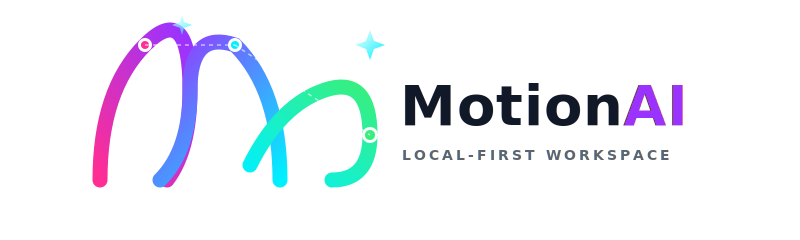
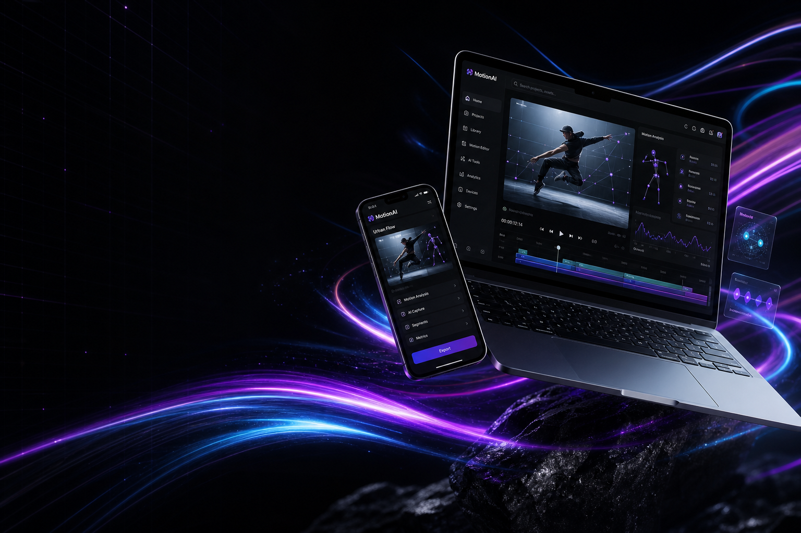
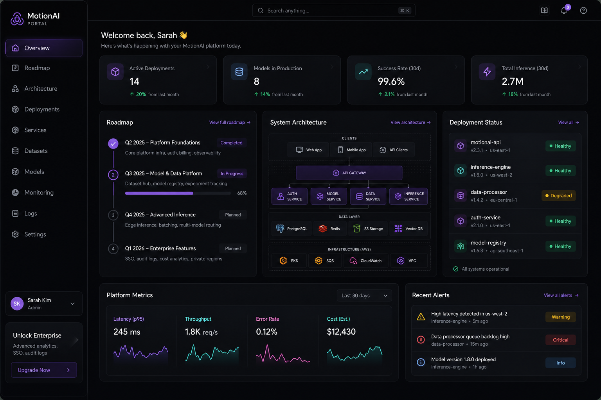
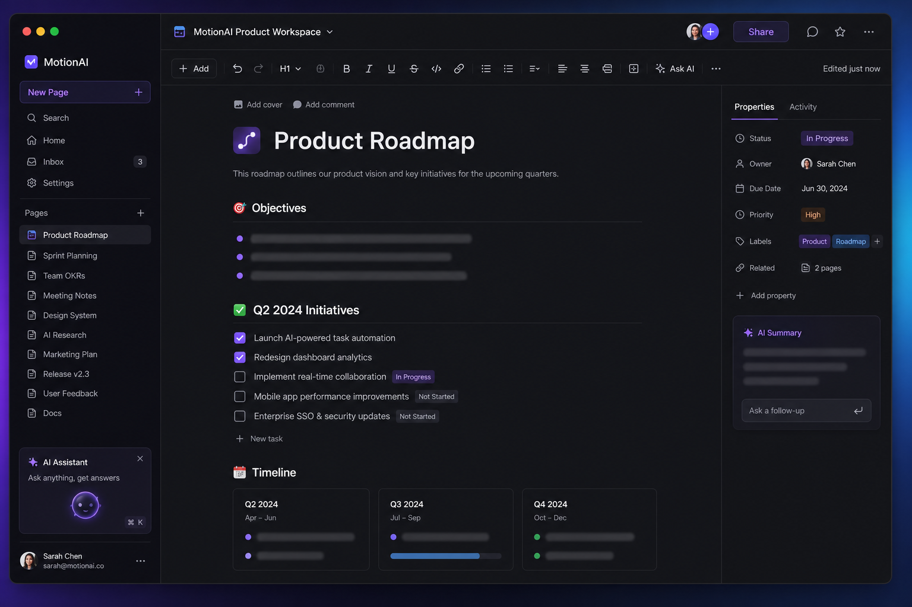
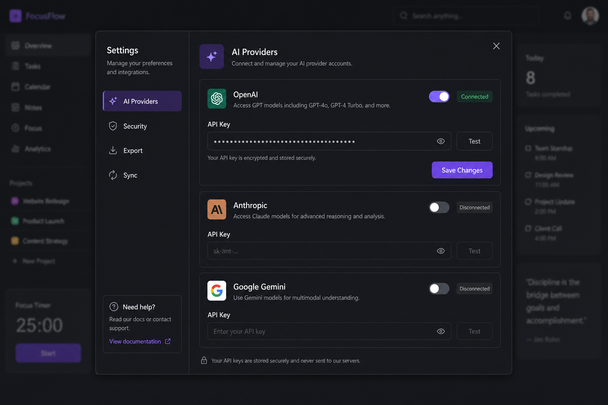
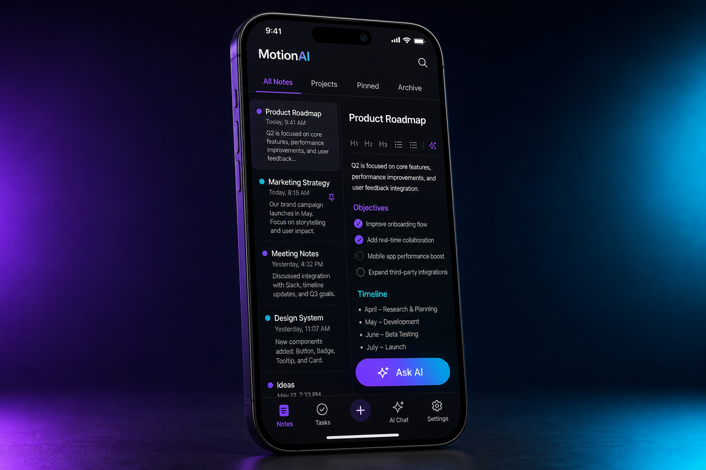

<div align="center">



<br /><br />

# Local-first workspace for notes, tasks, docs & AI

**Self-hostable · BYO/local AI · Y.js persistence · PWA-ready · Open source**

<p>
  <a href="#-visual-showcase"><strong>See it in action</strong></a> ·
  <a href="#-quick-start"><strong>Quick start</strong></a> ·
  <a href="#-features"><strong>Features</strong></a> ·
  <a href="#-install-on-your-phone"><strong>Add to home screen</strong></a> ·
  <a href="ROADMAP.md"><strong>Roadmap</strong></a>
</p>

<p>
  <a href="https://github.com/NaustudentX18/MotionAI/actions/workflows/ci.yml"></a>
  
  
  
  
  <a href="KNOWN_LIMITATIONS.md"></a>
</p>

</div>

---

## Hero

<picture>
  <source media="(prefers-color-scheme: dark)" srcset="docs/media/motionai-hero-cinematic.png" />
  
</picture>

<p align="center"><em>Notes, tasks, automations, and AI — on your hardware, under your rules.</em></p>

---

## Why MotionAI?

Most workspace tools force a trade-off: polished UX **or** local control, AI **or** privacy, collaboration **or** portability. MotionAI is built so a **private, self-hosted** setup still feels premium — block editing, command palette, integrations, and optional sync without renting your brain to a vendor cloud.

| | What you get |
| --- | --- |
| 🧠 | **Bring your own AI** — Gemini, OpenAI-compatible APIs, Ollama, LM Studio, vLLM, or off |
| 💾 | **Local-first** — Y.js + IndexedDB, import/export, optional AES-GCM at rest |
| ✍️ | **Polished editor** — TipTap slash commands, backlinks, comments, PDF export, dictation |
| 📱 | **Mobile & PWA** — Responsive shell, mic permission, home-screen install |
| 🛡️ | **Honest scope** — Experimental surfaces documented in [`KNOWN_LIMITATIONS.md`](KNOWN_LIMITATIONS.md) |

> [!IMPORTANT]
> MotionAI is **production-ready for private, single-user self-hosting**. Multi-tenant cloud security, public-internet hardening, and hosted sync are **not** claimed. See [`SECURITY.md`](SECURITY.md).

---

## Visual showcase

### Command center & editor

<table>
<tr>
<td width="50%">

**MotionAI Portal** — roadmap, architecture, and deployment hub



</td>
<td width="50%">

**Block editor** — headings, tasks, slash menu, AI inline actions



</td>
</tr>
</table>

### Settings & mobile

<table>
<tr>
<td width="50%">

**Settings** — AI providers, encryption, export, sync



</td>
<td width="50%">

**Mobile shell** — touch-first workspace with Ask AI



</td>
</tr>
</table>

🎬 **Walkthrough:** [Watch the live demo clip](docs/media/motionai-live-demo.webm) *(screen recording)*

<details>
<summary>Additional capture assets</summary>

Live captures (when generated from a running dev server):  
`docs/media/motionai-hub-live.png` · `docs/media/motionai-editor-live.png` · `docs/media/motionai-settings-live.png` · `docs/media/motionai-mobile-live.png`

</details>

---

## Quick start

### 1. Run locally

```bash
git clone https://github.com/NaustudentX18/MotionAI.git
cd MotionAI
npm install
npm run dev
```

Open **[http://localhost:5173](http://localhost:5173)** (or the port Vite prints). The Express API runs alongside the dev server.

> [!NOTE]
> If your checkout folder is still named `OpenNotion`, run commands from that directory. The GitHub repo is **MotionAI**.

### 2. Production build

```bash
npm run build
npm start
```

### 3. Docker Compose

```bash
docker compose up --build
```

### 4. Verify the tree

```bash
npm install
npm run build
npm run verify
```

| Script | Purpose |
| --- | --- |
| `npm run verify:static` | Docs & invariant checks |
| `npm run lint` | TypeScript |
| `npm run test:server-integration` | API smoke on ephemeral port |
| `npm run audit:secrets` | Block accidental secret commits |

---

## Install on your phone

MotionAI ships as a **Progressive Web App**:

1. Deploy over **HTTPS** (or use localhost for dev).
2. Open the site in **Safari** (iOS) or **Chrome** (Android).
3. **Add to Home Screen** / **Install app**.
4. Grant **microphone** when prompted for voice capture.

Shortcuts in `manifest.json` include quick capture (`/?action=capture`). See [`public/manifest.json`](public/manifest.json).

---

## Features

### Workspace & editor

- TipTap block editor: tasks, callouts, code, drag handles, wiki-links, PDF export
- Command palette (`Cmd/Ctrl+K`), unified search, AI composer
- MotionAI Portal hub, spatial canvas (tldraw prototype), mobile-optimized shell

### AI & integrations

- Multi-provider proxy: Gemini, OpenAI-compatible, Ollama, LM Studio, vLLM
- Contextual actions: summarize, rewrite, grammar, custom prompts
- Google Workspace helpers (Calendar, Drive, Tasks) behind auth guards

### Local-first foundation

- Y.js CRDTs + IndexedDB, multi-workspace import/export
- Optional AES-GCM encryption, service worker offline boot
- WebRTC sync (experimental), automation rules engine, Tauri desktop prototype

---

## Current status by capability

| Capability | Status | Reference |
| --- | --- | --- |
| React/Vite + Express API | Implemented | [`src/App.tsx`](src/App.tsx), [`server.ts`](server.ts) |
| TipTap + Y.js editor | Implemented | [`src/components/BlockEditor.tsx`](src/components/BlockEditor.tsx) |
| IndexedDB migrations | Implemented, still hardening | [`src/lib/persistence.ts`](src/lib/persistence.ts) |
| Multi-provider AI | Implemented | [`src/lib/ai/providers.ts`](src/lib/ai/providers.ts) |
| Backlinks & wiki-links | Implemented | [`src/lib/backlinks.ts`](src/lib/backlinks.ts) |
| PWA + offline SW | Implemented | [`public/sw.js`](public/sw.js) |
| tldraw canvas | Early prototype | [`src/components/CanvasEditor.tsx`](src/components/CanvasEditor.tsx) |
| WebRTC sync | Experimental | [`signaling-server.js`](signaling-server.js) |
| Production multi-user security | Not claimed | [`KNOWN_LIMITATIONS.md`](KNOWN_LIMITATIONS.md) |

---

## Supported AI providers

Configure in **Settings → AI Providers** or `.env`:

| Provider | Variable | Default endpoint |
| --- | --- | --- |
| Google Gemini | `GEMINI_API_KEY` | Google GenAI |
| OpenAI-compatible | `OPENAI_API_KEY` | `OPENAI_BASE_URL` |
| Ollama | — | `http://localhost:11434` |
| LM Studio | — | `http://localhost:1234` |
| vLLM | — | `http://localhost:8000` |

---

## Architecture

```text
src/
├── App.tsx                 # Shell, routing, workspace state
├── components/             # Editor, hub, palette, settings, mobile
├── hooks/                  # Editor, PWA, WebRTC, settings
├── lib/
│   ├── ai/providers.ts     # Provider adapters
│   ├── persistence.ts      # IndexedDB + migrations
│   └── yjs.ts              # CRDT sync
├── contexts/               # Workspace context
└── styles/tokens.css       # Design tokens
server.ts                   # API proxy, uploads, health
public/manifest.json        # PWA manifest
```

---

## Media assets

| File | Use |
| --- | --- |
| `docs/media/motionai-hero-cinematic.png` | README hero & splash background |
| `docs/media/motionai-*-showcase.png` | README gallery & splash filmstrip |
| `docs/media/motionai-logo.svg` | Brand mark (light/dark friendly) |
| `docs/media/motionai-live-demo.webm` | Demo video |

Regenerate live app captures (dev server required):

```bash
PLAYWRIGHT_BASE_URL=http://localhost:3000 node scripts/capture-readme-media.mjs
```

---

## Contributing

1. Read [`CONTRIBUTING.md`](CONTRIBUTING.md) and [`KNOWN_LIMITATIONS.md`](KNOWN_LIMITATIONS.md).
2. Run `npm run build && npm run verify` before opening a PR.
3. Never commit real API keys — use `npm run audit:secrets`.

---

## License

**Apache-2.0** — see [`LICENSE`](LICENSE).

<div align="center">

<br />

**[⭐ Star on GitHub](https://github.com/NaustudentX18/MotionAI)** · Built for people who want a workspace that stays on their machine.

</div>
