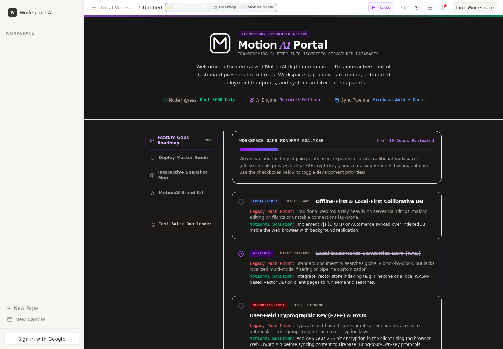
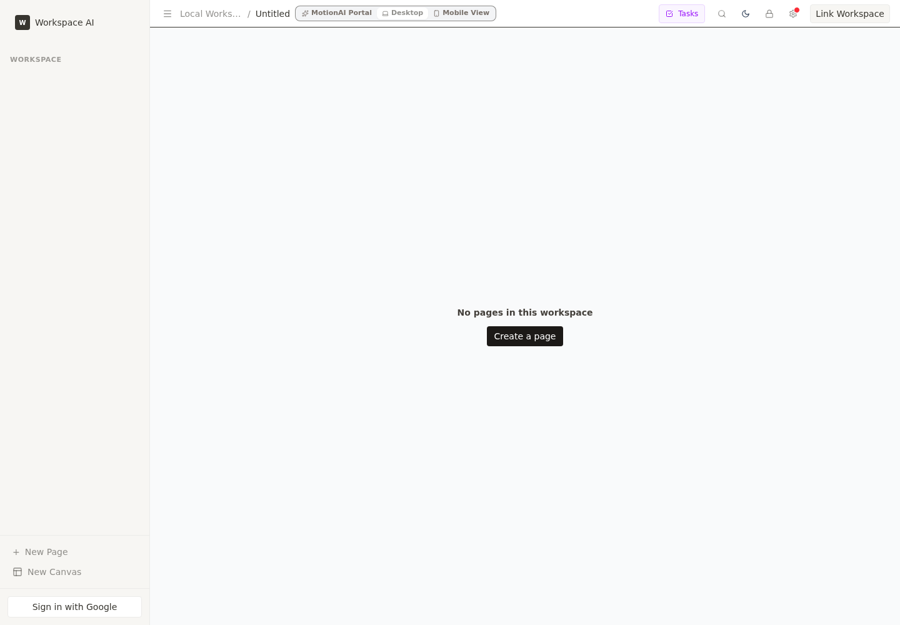

# OpenNotion / MotionAI

**OpenNotion** is a self-hostable, local-first workspace app with a Notion-style block editor, a polished MotionAI portal, optional multi-provider AI actions, Google Workspace helpers, local persistence, experimental Y.js collaboration, and a Tauri desktop prototype.

The repo currently runs as **MotionAI Document Space** on the local Pi, but the GitHub project name is **OpenNotion**.



## Live deployment proof

This app is running on the project server now:

- Local service: `http://127.0.0.1:3003`
- Tailnet/private server URL: `http://100.126.207.73:3003`
- systemd unit: `motionai.service`
- WebRTC signaling service: `motionai-signaling.service` on port `3005`

> The Tailnet URL is for private network access, not a public Internet demo link.

## Demo media

| View | Artifact |
| --- | --- |
| MotionAI portal / roadmap hub | [`docs/media/opennotion-hub-live.png`](docs/media/opennotion-hub-live.png) |
| Desktop block editor | [`docs/media/opennotion-editor-live.png`](docs/media/opennotion-editor-live.png) |
| AI/provider settings | [`docs/media/opennotion-settings-live.png`](docs/media/opennotion-settings-live.png) |
| Mobile workspace view | [`docs/media/opennotion-mobile-live.png`](docs/media/opennotion-mobile-live.png) |
| Short live app walkthrough | [`docs/media/opennotion-live-demo.webm`](docs/media/opennotion-live-demo.webm) |

## What it actually does today

- **Block workspace:** pages, headings, paragraphs, todos, quote/code/media-oriented block types, slash commands, comments, style controls, and PDF export.
- **Local-first storage:** Y.js-backed persistence in IndexedDB with legacy localStorage migration/fallback paths.
- **Experimental collaboration:** Y.js document state, y-indexeddb persistence, y-webrtc provider wiring, peer presence, and a self-hosted signaling server.
- **Optional encryption-at-rest:** passphrase-based PBKDF2 + AES-GCM for local workspace state; the passphrase is held in memory and can be saved through the Tauri keychain path where supported.
- **AI actions:** Express AI proxy with Gemini, OpenAI-compatible, Ollama, LM Studio, vLLM, and disabled/local-only modes. Provider keys are configured by the user and are not committed.
- **Google Workspace helpers:** Firebase Google sign-in wiring plus guarded Drive, Calendar, and Tasks helper calls.
- **Backlinks:** `[[Wiki Links]]` parsing and a local IndexedDB-backed backlinks index.
- **Canvas pages:** a basic canvas page type is present, currently a starter surface rather than a full infinite whiteboard product.
- **Desktop prototype:** Tauri v2 project files for ARM64 Linux builds.
- **Self-host deployment:** Express production server, Dockerfile, docker-compose template, systemd service examples, and a standalone WebRTC signaling server.

## Current status by capability

| Capability | Status | Evidence |
| --- | --- | --- |
| Rich block editor | Implemented | `src/components/BlockEditor.tsx`, `src/hooks/useBlockEditor.ts`, `src/components/blocks/` |
| Multi-workspace local persistence | Implemented | `src/lib/persistence.ts`, `src/lib/yjs.ts` |
| Y.js CRDT foundation | Implemented, still hardening | `src/lib/yjs.ts`, `src/lib/extensions/YjsBlockExtension.ts` |
| WebRTC document sync | Experimental | `src/App.tsx`, `signaling-server.js`, `docs/CRDT_CONFLICT_RESOLUTION.md` |
| Peer presence | Implemented | `src/lib/presence.ts`, `src/components/PresenceIndicator.tsx` |
| E2EE/local encrypted persistence | Implemented, with caveats | `src/lib/crypto.ts`, `src/lib/persistence.ts`, `src/lib/yjs.ts` |
| Multi-provider AI proxy | Implemented | `server.ts`, `src/lib/ai/providers.ts`, `scripts/ai-contract-tests.ts` |
| Google Drive/Tasks/Calendar helpers | Implemented behind auth | `src/lib/workspace.ts`, `src/components/DriveModal.tsx`, `src/components/TasksModal.tsx` |
| Backlinks | Implemented | `src/lib/backlinks.ts`, `src/lib/backlinksIndex.ts`, `src/components/BacklinksPanel.tsx` |
| Canvas pages | Early prototype | `src/components/CanvasEditor.tsx`, `src/types.ts` |
| Tauri desktop app | Prototype | `src-tauri/` |
| Multi-user production security | Not claimed | See [`KNOWN_LIMITATIONS.md`](KNOWN_LIMITATIONS.md) |

## Screenshots

### Live MotionAI portal


### Desktop editor



### Provider settings


### Mobile view


## Tech stack

- React 19 + TypeScript + Vite
- Express production server and API proxy
- Y.js, y-indexeddb, y-webrtc
- TipTap / ProseMirror editor stack
- IndexedDB + localStorage fallback
- Web Crypto API AES-GCM encryption
- Firebase Auth / Google Workspace API helpers
- Tauri v2 desktop shell prototype
- Playwright E2E/smoke test scaffolding

## Quick start

```bash
git clone git@github.com:NaustudentX18/OpenNotion.git
cd OpenNotion
npm install
cp .env.example .env
npm run dev
```

The default dev server uses `tsx server.ts`. The production service path is:

```bash
npm run build
PORT=3003 NODE_ENV=production node dist/server.cjs
```

## Environment configuration

`.env.example` documents the supported variables. The most important ones are:

```env
VITE_SIGNALING_URLS="ws://localhost:3005"
GEMINI_API_KEY="MY_GEMINI_API_KEY"
APP_URL="MY_APP_URL"
MOTIONAI_API_SECRET=your-secret-here
```

Notes:

- Do **not** commit `.env` or real provider keys.
- AI features remain disabled/not configured until a provider is configured.
- `MOTIONAI_API_SECRET` is optional for localhost-only use, but should be set before exposing the Express API beyond a trusted private network.

## Verification

Credential-free local checks:

```bash
npm run verify:static
npm run lint
npm run test:ai
npm run test:spellcheck
npm run test:workspace
npm run test:import-export
npm run test:smoke
npm run test:migration
```

Full local gate:

```bash
npm run verify
npm run build
```

Browser E2E scaffolding is available with:

```bash
npm run test:e2e
```

## Deployment on this Pi

The live service is managed by systemd:

```bash
systemctl --user status motionai.service
systemctl --user status motionai-signaling.service
curl -I http://127.0.0.1:3003
curl http://127.0.0.1:3005/health
```

Service facts from the current deployment:

- `motionai.service` runs `node dist/server.cjs` from `/home/pi/OpenNotion`
- `PORT=3003`
- `motionai-signaling.service` runs `node signaling-server.js`
- signaling health endpoint: `http://127.0.0.1:3005/health`

## Security and privacy boundaries

This project is designed for private/self-hosted use first. Current protections include local persistence, optional local encryption-at-rest, rate limiting, request-size limits, credential-free test coverage, and no committed `.env` file.

Important boundaries:

- The in-memory Y.Doc is plaintext after unlock so the editor can work.
- E2EE for multi-peer collaboration does not include a complete production key-exchange system.
- Firebase/Google OAuth configuration must be verified in the target Google Cloud/Firebase project.
- The Express AI API should not be exposed publicly without an auth/reverse-proxy review.
- See [`KNOWN_LIMITATIONS.md`](KNOWN_LIMITATIONS.md) for the conservative audit list.

## Roadmap

Near-term priorities are tracked in [`ROADMAP.md`](ROADMAP.md). The honest short version:

1. Harden CRDT/editor synchronization and persistence edge cases.
2. Turn the canvas page type into a real spatial workspace.
3. Tighten E2EE + collaboration semantics before calling it production-grade multi-user security.
4. Expand browser E2E coverage around first render, persistence, settings, AI-disabled states, and import/export.
5. Package and document the Tauri desktop prototype for a real desktop release path.

## License

Apache-2.0. See [`LICENSE`](LICENSE).
