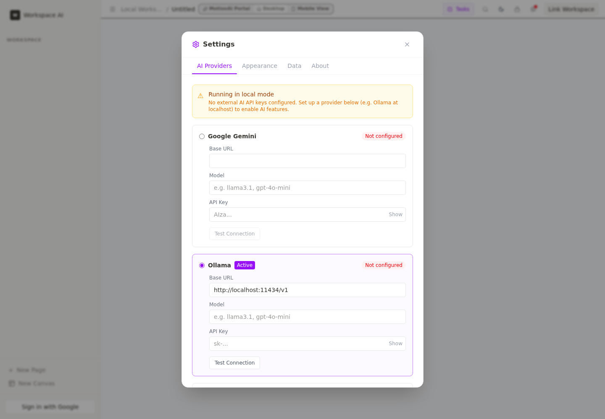
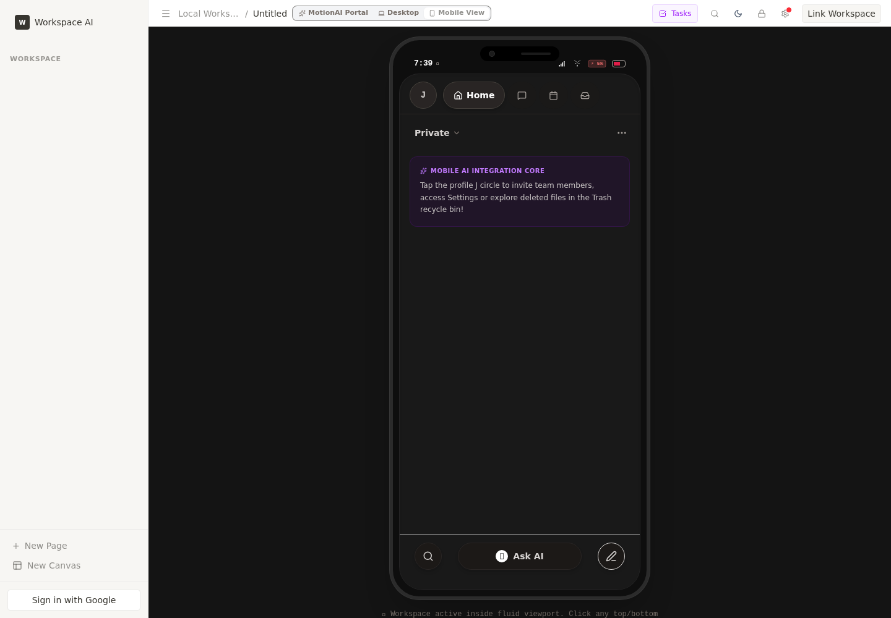

<div align="center">

# MotionAI

### A self-hostable, local-first AI workspace for notes, tasks, docs, and automations.

MotionAI combines a polished block editor, BYO/local AI actions, Y.js-backed persistence,
Google Workspace helpers, experimental collaboration, and a Tauri desktop prototype —
without locking your workspace into a vendor cloud.

[](https://github.com/NaustudentX18/MotionAI/actions/workflows/ci.yml)
[](LICENSE)


[Quick start](#quick-start) • [See it](#see-it) • [Features](#features) • [Architecture](#architecture) • [Roadmap](ROADMAP.md) • [Limitations](KNOWN_LIMITATIONS.md)

</div>

---

## Why MotionAI?

Most workspace tools force a trade-off: polished UX **or** local control, AI features **or** privacy, collaboration **or** portability. MotionAI is an open-source attempt to make the private, self-hosted version feel modern instead of second-class.

- **Bring your own AI** — Gemini, OpenAI-compatible endpoints, Ollama, LM Studio, vLLM, or disabled mode.
- **Keep data local-first** — Y.js + IndexedDB persistence, import/export, schema migrations, and optional encryption at rest.
- **Write in a real editor** — TipTap-powered blocks, slash commands, backlinks, comments, images, PDF export, dictation, and keyboard-first flows.
- **Run it yourself** — Vite + Express locally, Docker Compose, and an early Tauri desktop build path.
- **Stay honest about maturity** — shipped features, experimental surfaces, and security boundaries are documented instead of marketed away.

> **Current status:** production-ready for private, single-user self-hosted use. Production multi-user security, public-Internet hardening, encrypted collaboration, signed desktop releases, and hosted cloud sync are **not claimed**. See [`KNOWN_LIMITATIONS.md`](KNOWN_LIMITATIONS.md) and [`SECURITY.md`](SECURITY.md).

---

## See it

| Hub | Editor |
| --- | --- |
|  |  |

| Settings | Mobile |
| --- | --- |
|  |  |

**Demo:** [watch the short live app walkthrough](docs/media/motionai-live-demo.webm)

---

## Quick start

### Run locally

```bash
git clone https://github.com/NaustudentX18/MotionAI.git
cd MotionAI
npm install
npm run dev
```

Open <http://localhost:5173>. The Express API is served by the same dev entry point.

> If your local checkout directory is still named `OpenNotion`, run the same commands from that directory. The public GitHub repo is `MotionAI`.

### Production build

```bash
npm run build
npm start
```

### Docker

```bash
docker compose up --build
```

### Verify without credentials

```bash
npm install
npm run build
npm run verify
```

`npm run build` creates the server bundle used by the smoke check. `npm run verify` then runs credential-free checks for static documentation/source invariants, TypeScript, AI provider contracts, spellcheck schemas, Google Workspace helper guards, schema validation, browser/API smoke checks, persistence migrations, and large-workspace reliability.

Useful targeted checks:

```bash
npm run verify:static       # source + docs invariant checks
npm run lint                # TypeScript type-check
npm run test:ai             # mocked multi-provider AI contracts
npm run test:spellcheck     # spellcheck response schemas
npm run test:workspace      # Google Workspace auth/guard contracts
npm run test:import-export  # workspace export/import round trips
npm run test:smoke          # browser/API smoke checks
npm run test:migration      # persistence migration checks
npm run test:reliability    # large-workspace stress checks
```

---

## Features

### Workspace and editor

| Area | What is present today |
| --- | --- |
| Block editor | Paragraphs, headings, to-dos, lists, quotes, callouts, dividers, code blocks, inline styles, drag handles, comments, images, markdown shortcuts, auto-save, PDF export, and speech-to-text. |
| Knowledge layer | Backlinks and wiki-links with local indexing for connected notes. |
| MotionAI portal | Workspace hub, command palette, smart search, AI composer, inline AI actions, and quick navigation. |
| Canvas | Early spatial-canvas page prototype powered by tldraw. |
| Mobile | Mobile-oriented workspace shell for reading and editing from a phone browser. |

### AI and integrations

| Area | What is present today |
| --- | --- |
| BYO/local AI | Gemini, OpenAI-compatible providers, Ollama, LM Studio, vLLM, and disabled mode. |
| AI actions | Generate, draft, summarize, rewrite, spellcheck, and custom commands. |
| Secrets posture | Provider keys are user supplied and should live in `.env` or browser-local settings, not in Git. API responses keep `keysReturned: false` markers. |
| Google Workspace | Drive, Calendar, and Tasks helper flows behind interactive auth guards. Credential-free tests verify guard behavior. |

### Local-first foundation

| Area | What is present today |
| --- | --- |
| Persistence | Y.js document state with IndexedDB and localStorage fallback. |
| Workspaces | Create, rename, delete, switch, import, and export local workspaces. |
| Migrations | Schema versioning and migration coverage for legacy storage formats. |
| Encryption | Optional AES-GCM encryption at rest, with documented caveats. |
| Collaboration | WebRTC/Y.js sync wiring and peer presence are present but still experimental. |
| Desktop | Tauri prototype for local desktop packaging; signed releases and auto-update are not complete. |

---

## Current status by capability

| Capability | Status | Evidence |
| --- | --- | --- |
| React/Vite workspace + Express server | Implemented | `src/App.tsx`, `server.ts`, `vite.config.ts`, `npm run build` |
| Block editor with TipTap + Y.js | Implemented | `src/components/BlockEditor.tsx`, `src/hooks/useBlockEditor.ts`, `src/components/blocks/` |
| Local persistence and migrations | Implemented, still hardening | `src/lib/persistence.ts`, `src/lib/yjs.ts`, `src/lib/yjs-migration.ts`, `scripts/migration-tests.ts` |
| Import/export round trips | Implemented | `scripts/import-export-tests.ts` |
| Multi-provider BYO/local AI proxy | Implemented | `server.ts`, `src/lib/ai/providers.ts`, `scripts/ai-contract-tests.ts` |
| Spellcheck response validation | Implemented | `scripts/spellcheck-schema-tests.ts` |
| Google Workspace helpers | Implemented behind auth | `src/lib/workspace.ts`, `scripts/workspace-mock-tests.ts` |
| Backlinks / wiki-links | Implemented | `src/lib/backlinks.ts`, `src/lib/backlinksIndex.ts`, `src/components/BacklinksPanel.tsx` |
| Peer presence | Implemented | `src/lib/presence.ts`, `src/components/PresenceIndicator.tsx` |
| WebRTC document sync | Experimental | `src/App.tsx`, `signaling-server.js`, `e2e/` coverage in progress |
| Encryption at rest | Implemented, with caveats | `src/lib/crypto.ts`, `src/lib/persistence.ts`, `KNOWN_LIMITATIONS.md` |
| Canvas pages | Early prototype | `src/components/CanvasEditor.tsx`, `src/types.ts` |
| Tauri desktop app | Prototype | `src-tauri/Cargo.toml`, `src-tauri/tauri.conf.json` |
| Production multi-user security | Not claimed | `KNOWN_LIMITATIONS.md`, `SECURITY.md` |

---

## AI providers

Configure a provider in `.env` or in Settings → AI Providers.

| Provider | Configuration | Notes |
| --- | --- | --- |
| Gemini | `GEMINI_API_KEY` | Default Google Gemini endpoint. |
| OpenAI-compatible | `OPENAI_API_KEY` + `OPENAI_BASE_URL` | Works with compatible hosted or local APIs. |
| Ollama | `OLLAMA_BASE_URL` | Defaults to `http://localhost:11434`. |
| LM Studio | `LM_STUDIO_BASE_URL` | Defaults to `http://localhost:1234`. |
| vLLM | `VLLM_BASE_URL` | Defaults to `http://localhost:8000`. |
| Disabled | No provider config | AI calls fail safely with descriptive guard messages. |

---

## Architecture

```text
src/
├── App.tsx                    # App shell, navigation, workspace state
├── components/
│   ├── BlockEditor.tsx        # TipTap + Y.js editor surface
│   ├── CanvasEditor.tsx       # tldraw canvas prototype
│   ├── CommandPalette.tsx     # Cmd/Ctrl+K actions
│   ├── SettingsModal.tsx      # AI, data, security settings
│   ├── Sidebar.tsx            # Page and workspace navigation
│   └── blocks/                # Slash menu, AI menu, block UI pieces
├── hooks/                     # Editor, AI, settings, comments, spellcheck hooks
├── lib/
│   ├── ai/providers.ts        # Provider abstraction and guards
│   ├── crypto.ts              # AES-GCM encryption-at-rest helpers
│   ├── persistence.ts         # Workspace CRUD, migration, encryption glue
│   ├── yjs.ts                 # Y.Doc setup and IndexedDB persistence
│   ├── presence.ts            # Peer presence plumbing
│   ├── backlinks.ts           # Wiki-link extraction
│   └── workspace.ts           # Google Workspace helpers
├── main.tsx                   # React entry point
└── index.css                  # Tailwind v4 styles and dark mode

server.ts                      # Express API: AI proxy, auth, presence, uploads
signaling-server.js            # y-webrtc signaling server
src-tauri/                     # Tauri desktop prototype
```

---

## Project maturity

MotionAI uses conservative public claims by design:

- [`docs/SHIPPED.md`](docs/SHIPPED.md) records what is present now.
- [`KNOWN_LIMITATIONS.md`](KNOWN_LIMITATIONS.md) records what is not yet production-grade.
- [`ROADMAP.md`](ROADMAP.md) explains the trust, workspace, database, automation, collaboration, desktop, and release plan.
- [`SECURITY.md`](SECURITY.md) explains safe reporting and current security boundaries.

---

## Contributing

Contributions are welcome, especially around editor stability, local-first persistence, E2E coverage, accessibility, docs accuracy, and self-hosted deployment hardening.

Start with:

1. Read [`CONTRIBUTING.md`](CONTRIBUTING.md).
2. Check [`KNOWN_LIMITATIONS.md`](KNOWN_LIMITATIONS.md) before expanding public claims.
3. Run `npm run build` and `npm run verify` before opening a PR.
4. Include exact verification evidence in the PR template.

---

## License

Apache-2.0. See [`LICENSE`](LICENSE).
